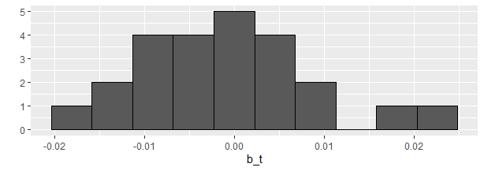

```{r setup, include=FALSE}
knitr::opts_chunk$set(echo = TRUE)
```

# Introduction

In this project,  a movie recommendation system using a MovieLens data set is proposed. The data set used in this project is downloaded from the [MovieLens website](https://grouplens.org/datasets/movielens/).   The 10M version  MovieLens data set is chosen to make the computation a little easier. This data set is referred to as "MovieLens data set" hereafter. 


The goal of the project is to design a movie recommendation system that can achieve a `RMSE` as good as possible, such as lower than 0.86490, which indicates, on a 5-star rating scale, the predication, on average, is not off by more than one star. We note that the Netflix Prize winners achieved the best Test `RMSE` of 0.8567 in 2009 on the Test set consisting of 1,408,789 ratings, roughly 1.4 times of the `validation` set used in this project, see the [Wikiedia page](https://en.wikipedia.org/wiki/Netflix_Prize). 

To achieve the goal of the project, building upon the regularized model with movie and user effects presented in the course,  three more biases are considered, one is due to the genres of movies, the second one is due to the hour when a rating is given (or recommended), and the third one reflects the effect of rate of ratings per year for a given movie. 

Moreover, observing the predicted ratings by the proposed model will result in predictions outside the rating range $[0.5, 5]$, an out-of-range correction is performed to improve the final prediction. 


Bootstrap cross-validation approach is used to select the best regulation parameter in training by randomly splitting the set `edx` into `train_set` and `test_set`. The  `test_set` contains approximately $10\%$ ratings of the set `edx`. 

We then use the best regulation parameter  to train the proposed  model  on the entire `edx` set. The trained model then is applied to the `validation` set created in the beginning. A   `RMSE` of 0.864305 is obtained using our model. 


The proposed model is different than 
the one presented in the course by considering three more effects: the movie genres, the hour when a rating is given, and the rate of ratings for a movie. Moreover, the out-of-range correction further improves the predictions.  Our experiments demonstrate the proposed model is effective and has achieved a relatively good result. 


# Methods and Analysis


## Data cleaning, exploration and visualization


After downloading the raw data set, the raw data set was wrangled into two data frames in R format. These two data frames are: `edx` and `validation`. The `edx` set is used for training, and the `validation` set is hold out  until a final recommendation  model is created. Finally,  the `validatio`n set is used to test the accuracy of the proposed model using the root mean square error (`RMSE`) criterion. 

Table 1 describes the general properties of the sets `edx` and `validation`. The number of observations in the set `validation` is approximately $10\%$ of the downloaded 10M MovieLens data set. 


------------------------------------------------------------------------
                                    `edx`                   `validation`  
-----------------  ----------------------         ----------------------
Number of rows          9000055                    999999  

Number of columns         6                             6      

Column labels       `userId`, `movieId`,          `userId`, `movieId`, 

                    `rating`, `timestamp`,        `rating`, `timestamp`, 
                    
                    `title`, `genres`             `title`, `genres`      
                    
------------------------------------------------------------------------                    
Table: `edx` data set and `validation` data set


Tables 2 and 3 describes the column features in both sets `edx` and `validation`. The column "total numbers" indicates the total number of distinct observations. For example, in the set `edx` there are 69,878 distinct users vs. 68,534 distinct users in the `validation` set. 


------------------------------------------------------------------------  
   Col. name      class       range   total numbers
------------  ---------   ----------  -------------
`userId`         int        [1,71567]       69878 

`movieId`       int         [1,65133]      10677  

`rating`         num        [0.5,5.0]                

`timestamp`       int                                  

`title`           chr                     10676            

`genres`         chr                       797  

------------------------------------------------------------------------
Table: Description of the column features in `edx`


------------------------------------------------------------------------  
   Col. name      class       range   total numbers
------------  ---------   ----------  -------------
`userId`         int        [1,71567]       68534 

`movieId`       int         [1,65133]      9809  

`rating`         num        [0.5,5.0]                

`timestamp`       int                                 

`title`           chr                     9808         

`genres`         chr                       773            

------------------------------------------------------------------------
Table: Description of the column features in `validation`


## Explore the genres effect 
Movie genres   intuitively influence a user's rating to suite an individual's taste. This can be confirmed by computing the average ratings $b_g$ for different genres minus the overall average rating $\mu$ for all movies by all users. 

If a movie is tagged with multiple genres, for example, "Romance|Sci-Fi", this will be considered as a unique genres that is different than either "Romance" or "Sci-Fi". This is because a movie tagged with "Romance|Sci-Fi" is different than just "Romance" or just "Sci_Fi", hence should be considered separately. From Table 2 and 3 one can see that there are 797 distinct genres in the `train_set` and 773 distinct genres in the `validation` set. 

From the histogram below, we can see that these estimates vary substantially, which indicate that movie genres play significant roles in rating a movie by a user, and should definitively be included in a model. 


## Explore the effect of `hour` when a rating is given  

To consider the factor of time when a rating is given or (recommended in case a recommendation is made), a new feature column will be added to both the `edx` set and  the `validation` set by using the column `timstamp`. To convert a `timestamp` which is a number of seconds since 1/1/1970, the library `lubridate` needs to be loaded,  
```{r  eval=FALSE, message=FALSE}
library(lubridate)
```
Then the functions `as_datetime` and `hour` are used to extract the `hour` of a `timestamp`. The codes are: 
```{r eval=FALSE, message=FALSE}
train_set_0 <- edx %>% mutate(hour=hour(as_datetime(timestamp)))

validation <- validation %>% mutate(hour=hour(as_datetime(timestamp))) 
```
Note there are 24 different hours in a day. That is, the column `hour` has 24 different groups. 
The hour during a day when a movie rating is given or recommended may play a role as well, such as a user tend to give a higher rating during the evening hours. To confirm this hypothesis, 
we compute the average ratings minus the overall average rating $\mu$ at different hours during a day, which we denoted by $b_t$. From the histogram below, we can see that these estimates vary slightly within the magnitude of about 0.02, which indicate that the `hour` when a rating is given or recommended plays a slight effect in rating a movie by a user. We decided to include this bias as well in our model. 



## Explore the effect of rate of ratings for a  movie

It is intuitive that  the most frequently rated movies tend to have above average ratings. This is not surprising: more people watch popular movies. To confirm this, we stratify the movies by ratings per year and compute their average ratings. We then make a plot of average rating versus ratings per year and show an estimate of the trend in blue. In the figure, the $x$-axis `rate` represents the rates of ratings per year for movies. For a given movie $i$, its rate of ratings $\text{rate}_i$ is defined by 
$$
\text{rate}_i=\frac{\mbox{total number of ratings}}{\mbox{number of years with ratings}}
$$


From the blue trend shown in the above plot, it is clear that our intuition is confirmed. The trend will be simply modeled by a regression line using the R funciton `lm`. 

The plot can be generated using the following code.  
```{r eval=FALSE}
train_set_0 %>% mutate( date = as_datetime(timestamp)) %>%
  mutate(year=year(date)) %>% group_by(movieId) %>%
  summarize(n = n(), years = max(year) - min(year)+1,
            rating = mean(rating)) %>%
  mutate(rate = n/years) %>%
  ggplot(aes(rate, rating)) +
  geom_point() +
  geom_smooth()
```

## Modeling Approach
From the analysis above, we decided to develop a regularized model that accounts the effects of users, movies, movie genres, the hour when a rating is given, and the rate of ratings for a movie.   The model  can be described as: 
\begin{align}\label{eq:model}
Y_{u,i,g,t} = \mu +b_i +b_u + b_g + b_t + b_i^r + \lambda\left( \sum_{i}b_i^2+ \sum_{u}b_u^2 + \sum_{g}b_g^2 +\sum_{t}b_t^2  \right) +\epsilon_{u,i,g,t},
\end{align}
where, $Y_{u,i,g,t}$ is the  rating given by user `u` to  movie `i` of genre `g` at the hour `t`; $\mu$ is the average of all ratings of  all movies by all users; $b_i$ is the bias from movie $i$; $b_u$ is the bias from user $u$;  $b_g$ is the bias from movie genre $g$;  $b_t$ is the bias of time in hour when a rating is given; $b_i^r$ is the bias due to the effect of rate of ratings for a given movie $i$; $\epsilon_{u,i,g,t}$ are independent errors sampled from the same distribution centered at 0. 


To be precise, let $y_{u,i,g,t}$ be the rating for movie $i$ of genre $g$ by user $u$ at the hour $t$ and denote our prediction by $\hat{y}_{u,i,g,t}$. The `RMSE` is then defined as: 
$$
\text{RMSE}=\sqrt{\frac{1}{N}\sum_{u,i,g,t}\left(\hat{y}_{u,i,g,t}-y_{u,i,g,t}\right)}
$$
where, $N$ indicates the number of user/movie/genre/hour combinations and the sum occurring over all these combinations.  

We will need to search for a good regulation parameter to obtain good results. Bootstrap cross-validation approach is adopted to select the best regulation parameter in training. To demonstrate the concept, 5 folds are used in this project.

The following grid of the regulation parameters $\lambda$ is used: 
```{r eval=FALSE}
lambdas <- seq(0,10,0.25)
```
For each $\lambda$,  randomly split the set `edx` into `train_set` and `test_set` with `test_set` containing approximately $10\%$ of observations in the set `edx`. In this project, 5 folds are used to ease the burden of computation. In the figure below, the RMSE is plotted with each $\lambda$. Each RMSE value for a particular $\lambda$ is an average of *five* RMSE values evaluated on   five random `test_sets`. We remark that 
$\lambda=0$ corresponds to the scenario of no regulation. 


From the figure, one can find that the best regulation parameter for the fitted model is found to be 
$$\lambda_{\text{best}}=4.75.$$ 

We then use the best regulation parameter $\lambda_{\text{best}}=4.75$ to train the proposed model  on the entire `edx` set. The resulted model then is finally tested on the `validation` set created in the beginning.   

## Out-of-range correction

The proposed model will result in prediction outside the actual rating range $[0.5,5]$. Therefore it is not harmful to correct out-of-range predictions. The corrections can be simply done using the following code: 
```{r eval=FALSE}
OFR_corr <- function(pred){
  pred[pred>5] <- 5
  pred[pred<0.5] <- 0.5
  return(pred)
  }
```
The code simply corrects a rating to the highest possible rating 5 when a predicted rating is great than 5 and set a rating to the lowest rating 0.5 when a predicted rating is smaller than 0.5. 
The function `OFR_corr` will be applied to the predicted ratings of our proposed model when in the testing phase. 


# Results

Using the best regulation parameter $\lambda=4.75$ obtained in the training phase,  we obtained our final model by applying the proposed model to the entire `edx` set. 

Table 4 compares different models with different effects. It is clear that the proposed model considering the effects of `genres`, `hour` and `rate of ratings` achieves the best result. The effect of adding `genres` is the most substantial, followed by the out-of-range correction, while the effects of   `hour` or `rate of rating` is much minor. 

------------------------------------------------------------------------  
                    Method (with regularization $\lambda=4.75$)                  `RMSE`       
-----------------------------------------------------------            ------------   
just movie and user effects                                             0.864820  

with `genres` effect added                                              0.864451  

with `genres` and `hour` effects added                                  0.864443  

with `genres`, `hour`, and `rate of ratings` effects added              0.864414

with out-of-range correction                                            0.864305

------------------------------------------------------------------------
Table: Comparison of different methods by `RMSE`


Apply  the final model  to the validation set, 
we have achieved the  
\begin{equation}
\text{RMSE}=0.864305
\end{equation}
on the `validation` set. The result is **better** than the goal of 0.86490.


# Conclusion

This report describes the approach to create a movie recommendation system using regularized model. The proposed model is different than 
the one presented in the course by considering three more effects: the move genres, the hour when a rating is given, and the rate of ratings for a movie. Moreover, the out-of-range correction is performed.  The experiments demonstrate the proposed model is effective and has achieved a relatively good result. 

The proposed model does not consider the correlations among movies or the correlations among genres. Both  may be analyzed by matrix factorization using PCA. Future work may include using matrix factorization such as PCA to analyze the correlations among movies or among genres.  

The proposed model does  not consider the effect of time since a move was released. Future work may also  consider the effect of time since  a movie was released. 

Further more, in the proposed model, we treat a combination of more than one genres as a unique genre. This may be  compared to  the  model  that replaces $b_g$ by

\begin{align}\label{eq:model2}
\sum_{g\in G}b_gx_{u,i}^g ,
\end{align}

where, $x_{u,i}^g =1$ if a rating given by user $u$ to movie $i$ is of genre $g$, and $g$ is defined as a single genre that may not be a combination of several genres. The set $G$ is defined as the set of all genres movie $i$ is categorized. 


